# Nìmata - Epic Breakdown

**Author:** Eduardo
**Date:** 2025-10-16
**Project Level:** 2
**Target Scale:** 5-15 stories, 1-2 epics, focused PRD + solutioning handoff

---

## Epic Overview

Nìmata MVP delivers the complete three-pillar quality cascade (Start Right → Find Right → Fix Right) through 3 epics containing 30 parallelizable stories. Stories are organized into swim lanes to enable 4-5 developers to work concurrently with minimal blocking dependencies.

**Total Stories:** 30 across 3 epics
**Development Model:** Parallel development within epics, sequential epic delivery
**Timeline:** 6 sprints (12 weeks) + 1 integration sprint

---

## Epic 1: Start Right - Quality-First Scaffolding

**Epic Goal:** Enable developers to scaffold TypeScript+Bun CLI projects with comprehensive quality tooling and AI context files pre-configured

**Epic Value:** Eliminates 2-4 hours of manual setup, generates persistent AI context (Claude Code & GitHub Copilot) to reduce hallucinations

**Total Stories:** 10
**Estimated Effort:** ~35% of total development
**Duration:** Sprints 1-2 (4 weeks)

### Swim Lane A: CLI Infrastructure (Dev 1)

#### Story 1.1: CLI Framework Setup

**Description:** Set up core CLI application framework with command routing and argument parsing

**Acceptance Criteria:**

- [ ] CLI entry point (`bin/nimata`) executes successfully
- [ ] Command routing supports subcommands (init, validate, fix, prompt)
- [ ] Argument parsing handles flags and options (--help, --version, --config)
- [ ] Help text displays for each command
- [ ] Version number displays correctly
- [ ] Exit codes follow Unix conventions (0=success, non-zero=error)

**Technical Notes:**

- Evaluate Commander.js vs Oclif for CLI framework
- TypeScript compilation target: ES2022
- Bun runtime: 1.1.3+

**Dependencies:** None (can start immediately)
**Estimated Effort:** 3 days

---

#### Story 1.2: Configuration System

**Description:** Implement configuration management system for project-level and global settings

**Acceptance Criteria:**

- [ ] Reads `.nimatarc` file from project root (YAML format)
- [ ] Supports global config in `~/.nimata/config.yaml`
- [ ] Project config overrides global config
- [ ] Configuration schema validation with clear error messages
- [ ] Default values for all optional settings
- [ ] Config can be programmatically loaded and validated

**Configuration Schema:**

```yaml
version: 1
qualityLevel: strict # light, medium, strict
aiAssistants: [claude-code, copilot]
validation:
  cache: true
  parallel: true
refactoring:
  preview: true
```

**Dependencies:** Story 1.1
**Estimated Effort:** 2 days

---

### Swim Lane B: Scaffolding Engine (Dev 2)

#### Story 1.3: Interactive Wizard

**Description:** Build interactive CLI wizard that collects project configuration through user prompts

**Acceptance Criteria:**

- [ ] Wizard collects: project name, description, quality level, AI assistants
- [ ] Each question has inline help accessible via `[?]` key
- [ ] Smart defaults pre-selected (Strict quality, common AI tools)
- [ ] Multi-select support for AI assistants list
- [ ] Input validation with actionable error messages
- [ ] Progress indicator shows current step / total steps
- [ ] Can navigate back to previous questions
- [ ] Wizard completes in <15 questions

**Dependencies:** Story 1.1, Story 1.2
**Estimated Effort:** 4 days

---

#### Story 1.4: Directory Structure Generator

**Description:** Generate opinionated directory structure for TypeScript+Bun CLI projects

**Acceptance Criteria:**

- [ ] Creates standard directories: src/, tests/, bin/, docs/, .nimata/
- [ ] Generates entry point file: `src/index.ts`
- [ ] Creates bin launcher script with proper shebang
- [ ] Generates .gitignore with node_modules, .nimata/cache/, dist/
- [ ] Creates README.md with basic project info
- [ ] All directories and files have correct permissions
- [ ] Structure supports SOLID architecture principles

**Directory Structure:**

```
project-name/
├── src/
│   ├── index.ts
│   ├── cli/
│   ├── core/
│   └── utils/
├── tests/
│   └── index.test.ts
├── bin/
│   └── cli.ts
├── docs/
├── .nimata/
│   └── cache/
├── .gitignore
├── README.md
├── package.json
├── tsconfig.json
└── .nimatarc
```

**Dependencies:** Story 1.3
**Estimated Effort:** 3 days

---

#### Story 1.5: Template Engine

**Description:** Implement template rendering system for generating project files from templates

**Acceptance Criteria:**

- [ ] Loads templates from `templates/typescript-bun-cli/` directory
- [ ] Variable substitution: {{project_name}}, {{description}}, etc.
- [ ] Conditional blocks: {{#if strict}}...{{/if}}
- [ ] Template validation before rendering
- [ ] Generates files with correct content and formatting
- [ ] Template catalog supports future tech stack additions
- [ ] Error handling for missing/invalid templates

**Dependencies:** Story 1.4
**Estimated Effort:** 3 days

---

### Swim Lane C: Quality Tool Configuration (Dev 3)

#### Story 1.6: ESLint Configuration Generator

**Description:** Generate ESLint configuration based on selected quality level

**Acceptance Criteria:**

- [ ] Creates .eslintrc.json with appropriate rules for quality level
- [ ] Light: Basic formatting and common errors only
- [ ] Medium: Standard TypeScript rules + best practices
- [ ] Strict: Comprehensive rules including no-any, prefer-readonly, complexity limits
- [ ] Installs required ESLint packages in package.json
- [ ] ESLint config passes validation (eslint --print-config works)
- [ ] Generated project passes `eslint src/` immediately after scaffolding

**Dependencies:** Story 1.5
**Estimated Effort:** 3 days

---

#### Story 1.7: TypeScript Configuration Generator

**Description:** Generate tsconfig.json optimized for Bun + CLI projects

**Acceptance Criteria:**

- [ ] Creates tsconfig.json with strict mode enabled
- [ ] Target: ES2022, module: ESNext
- [ ] Source maps enabled for debugging
- [ ] Declaration files generated for library mode
- [ ] Path aliases configured (@/ for src/)
- [ ] Exclude node_modules, dist, tests from compilation
- [ ] TypeScript compiler validates config successfully
- [ ] Generated project compiles with `tsc --noEmit`

**Dependencies:** Story 1.5
**Estimated Effort:** 2 days

---

#### Story 1.8: Prettier & Bun Test Configuration

**Description:** Generate Prettier formatting config and Bun Test setup

**Acceptance Criteria:**

- [ ] Creates .prettierrc.json with opinionated formatting rules
- [ ] Single quotes, 2-space indent, trailing commas, 100 char line width
- [ ] Creates .prettierignore for dist/, node_modules/
- [ ] Bun Test configured in package.json scripts
- [ ] Sample test file generated in tests/ that passes
- [ ] `bun test` runs successfully on freshly scaffolded project
- [ ] `prettier --check src/` passes on generated code

**Dependencies:** Story 1.5
**Estimated Effort:** 2 days

---

### Swim Lane D: AI Rules Generation (Dev 4)

#### Story 1.9: AI Rules Library & CLAUDE.md Generator

**Description:** Create rules library and generate CLAUDE.md file with persistent AI context

**Acceptance Criteria:**

- [ ] Rules library contains common TypeScript/Bun best practices
- [ ] Generates CLAUDE.md in project root with:
  - Project structure explanation
  - Coding standards (no any, readonly preferences, testing requirements)
  - Architecture decisions (SOLID, where to add new features)
  - Quality level constraints
  - Common patterns and anti-patterns
- [ ] Rules adapt based on quality level (Light/Medium/Strict)
- [ ] CLAUDE.md is human-readable markdown
- [ ] File size < 10KB (fast for AI to parse)
- [ ] Includes examples of good/bad code patterns

**Dependencies:** Story 1.5
**Estimated Effort:** 4 days

---

#### Story 1.10: GitHub Copilot Instructions Generator

**Description:** Generate GitHub Copilot instructions file for AI context

**Acceptance Criteria:**

- [ ] Generates `.github/copilot-instructions.md` with project context
- [ ] Contains coding standards and architectural decisions
- [ ] Format optimized for GitHub Copilot parsing
- [ ] Adapts based on selected quality level
- [ ] Includes TypeScript/Bun specific conventions
- [ ] File follows GitHub Copilot best practices documentation
- [ ] Instructions are concise (<5KB) for fast parsing

**Dependencies:** Story 1.9
**Estimated Effort:** 2 days

---

### Swim Lane E: Integration & Quality Levels (Dev 5)

#### Story 1.11: Quality Level Presets & End-to-End Init

**Description:** Implement quality level preset system and integrate all scaffolding components

**Acceptance Criteria:**

- [ ] Three preset configurations: Light, Medium, Strict
- [ ] Each preset defines: ESLint rules, TypeScript strictness, test coverage thresholds
- [ ] Preset selection during wizard affects all generated configs
- [ ] End-to-end `nimata init my-project` workflow completes successfully
- [ ] Generated project structure is correct for all quality levels
- [ ] All generated files are valid (compile, pass validation)
- [ ] Scaffolding completes in <30 seconds
- [ ] User can immediately run `cd my-project && bun test` successfully

**Dependencies:** Stories 1.3, 1.6, 1.7, 1.8, 1.9, 1.10
**Estimated Effort:** 3 days

---

## Epic 2: Find Right - Unified Quality Validation

**Epic Goal:** Orchestrate multiple quality tools (ESLint, TypeScript, Prettier, Bun Test) through single command with intelligent caching

**Epic Value:** Single-command validation with fast incremental feedback (<2s for unchanged files)

**Total Stories:** 10
**Estimated Effort:** ~35% of total development
**Duration:** Sprints 3-4 (4 weeks)

### Swim Lanes B: Tool Integrations (Devs 1-4 in parallel)

#### Story 2.1: ESLint Integration

**Description:** Integrate ESLint execution with Nìmata validation orchestration

**Acceptance Criteria:**

- [ ] Runs ESLint programmatically via Node API (not shell command)
- [ ] Respects project's .eslintrc.json configuration
- [ ] Captures lint errors with file path, line number, rule name, message
- [ ] Returns structured results (not just text output)
- [ ] Handles ESLint errors gracefully (config issues, parsing errors)
- [ ] Supports incremental linting (only changed files when using cache)
- [ ] Execution time logged for performance monitoring

**Dependencies:** Epic 1 complete
**Estimated Effort:** 3 days
**Assigned To:** Dev 1

---

#### Story 2.2: TypeScript Compiler Integration

**Description:** Integrate TypeScript compiler for type checking validation

**Acceptance Criteria:**

- [ ] Runs TypeScript compiler programmatically (tsc API)
- [ ] Executes type checking without emitting files (--noEmit equivalent)
- [ ] Captures type errors with file, line, column, error code, message
- [ ] Returns structured diagnostic results
- [ ] Respects project's tsconfig.json
- [ ] Handles compiler errors gracefully
- [ ] Supports incremental type checking (only changed files + dependencies)

**Dependencies:** Epic 1 complete
**Estimated Effort:** 3 days
**Assigned To:** Dev 2

---

#### Story 2.3: Prettier Integration

**Description:** Integrate Prettier for code formatting validation

**Acceptance Criteria:**

- [ ] Runs Prettier programmatically to check formatting
- [ ] Uses --check mode (validates without modifying files)
- [ ] Respects .prettierrc.json configuration
- [ ] Captures formatting violations with file paths
- [ ] Returns structured results indicating which files need formatting
- [ ] Handles configuration errors gracefully
- [ ] Fast execution (<1s for typical project)

**Dependencies:** Epic 1 complete
**Estimated Effort:** 2 days
**Assigned To:** Dev 3

---

#### Story 2.4: Bun Test Integration

**Description:** Integrate Bun Test runner for test execution and coverage

**Acceptance Criteria:**

- [ ] Runs Bun Test programmatically via Bun API
- [ ] Executes all tests in tests/ directory
- [ ] Captures test results: passed, failed, skipped counts
- [ ] Collects coverage data if available
- [ ] Returns structured test results (not just console output)
- [ ] Handles test failures gracefully (doesn't crash validation)
- [ ] Reports test execution time

**Dependencies:** Epic 1 complete
**Estimated Effort:** 3 days
**Assigned To:** Dev 4

---

### Swim Lane A: Orchestration (Dev 5)

#### Story 2.5: Parallel Execution Engine

**Description:** Build orchestration layer that runs quality tools in parallel

**Acceptance Criteria:**

- [ ] Runs all 4 tools (ESLint, TypeScript, Prettier, Tests) concurrently
- [ ] Uses Promise.all or similar for parallel execution
- [ ] Continues execution even if one tool fails
- [ ] Collects results from all tools
- [ ] Reports total execution time and per-tool timing
- [ ] Resource limits prevent system overload (CPU/memory)
- [ ] Graceful degradation if tool crashes

**Dependencies:** Stories 2.1, 2.2, 2.3, 2.4
**Estimated Effort:** 3 days

---

#### Story 2.6: Result Aggregation

**Description:** Aggregate validation results from all tools into unified structure

**Acceptance Criteria:**

- [ ] Unified result schema containing all tool outputs
- [ ] Overall pass/fail status based on all tools
- [ ] Error count aggregation across tools
- [ ] Warning count aggregation
- [ ] File-level aggregation (all issues for each file grouped together)
- [ ] Severity levels normalized (error, warning, info)
- [ ] Results serializable to JSON for caching/reporting

**Result Schema:**

```typescript
interface ValidationResults {
  success: boolean;
  totalErrors: number;
  totalWarnings: number;
  executionTime: number;
  tools: {
    eslint: ToolResult;
    typescript: ToolResult;
    prettier: ToolResult;
    tests: ToolResult;
  };
  fileResults: Map<string, FileIssue[]>;
}
```

**Dependencies:** Story 2.5
**Estimated Effort:** 2 days

---

### Swim Lane C: Performance (Dev 3)

#### Story 2.7: File Hashing System

**Description:** Implement file content hashing for cache invalidation

**Acceptance Criteria:**

- [ ] Computes hash for each source file (SHA256 or similar)
- [ ] Stores hash with file path and timestamp
- [ ] Detects file changes by comparing current hash to cached hash
- [ ] Handles file deletions and additions
- [ ] Fast computation (<1ms per file for typical sizes)
- [ ] Hash storage persists between validation runs

**Dependencies:** Story 2.6
**Estimated Effort:** 2 days

---

#### Story 2.8: Cache Storage & Invalidation

**Description:** Implement caching layer for validation results with intelligent invalidation

**Acceptance Criteria:**

- [ ] Stores validation results in `.nimata/cache/validation.json`
- [ ] Cache structure: file hash → validation results mapping
- [ ] Invalidates cache entry when file hash changes
- [ ] Invalidates entire cache when config changes (.nimatarc, .eslintrc, etc.)
- [ ] Cache persists between runs (file-based storage)
- [ ] Cache can be manually cleared via `--no-cache` flag
- [ ] Cache size limited (automatically prunes old entries if >100MB)

**Dependencies:** Story 2.7
**Estimated Effort:** 3 days

---

### Swim Lane E: CLI Reporting (Dev 2)

#### Story 2.9: Unified CLI Output

**Description:** Create clear, actionable CLI output for validation results

**Acceptance Criteria:**

- [ ] Shows summary: ✓/✗ per tool with pass/fail status
- [ ] Displays execution time per tool and total time
- [ ] Lists all errors grouped by file
- [ ] Includes file path, line number, and error message for each issue
- [ ] Color-coded output (green=pass, red=fail, yellow=warning)
- [ ] Non-color indicators for accessibility (✓✗⚠ symbols)
- [ ] Actionable footer: suggests "nimata fix" if simple issues found
- [ ] Respects --quiet flag for CI/CD (only errors, no visual flourishes)

**Example Output:**

```
Validating Nìmata project...

✓ ESLint        (2.1s) - No issues
✗ TypeScript    (3.4s) - 2 errors
✓ Prettier      (0.8s) - No issues
✓ Tests         (5.2s) - 15 passed

Errors found:

src/index.ts:42:12 - TS2322: Type 'string' is not assignable to type 'number'
src/utils.ts:15:5 - TS7006: Parameter 'x' implicitly has an 'any' type

Run 'nimata fix' to auto-fix simple issues, or 'nimata prompt' for AI assistance.
```

**Dependencies:** Story 2.6
**Estimated Effort:** 3 days

---

#### Story 2.10: Validate Command Integration

**Description:** Integrate all validation components into `nimata validate` command

**Acceptance Criteria:**

- [ ] `nimata validate` executes complete validation workflow
- [ ] Supports flags: --no-cache, --quiet, --reporter=<format>
- [ ] Exit code 0 if all tools pass, 1 if any tool fails
- [ ] Cache improves performance: <2s for unchanged project
- [ ] First run (no cache) completes in <30s for medium project
- [ ] Works from any subdirectory within project (finds project root)
- [ ] Detailed validation results accessible via --verbose flag

**Dependencies:** Stories 2.5, 2.6, 2.8, 2.9
**Estimated Effort:** 2 days

---

## Epic 3: Fix Right - Intelligent Refactoring & Triage

**Epic Goal:** Implement intelligent triage that routes simple fixes to static refactoring and complex issues to AI-assisted refactoring

**Epic Value:** 10x faster fixes for simple issues, AI prompts (Claude Code & Copilot format) for complex refactoring

**Total Stories:** 10
**Estimated Effort:** ~30% of total development
**Duration:** Sprints 5-6 (4 weeks)

### Swim Lane C: Static Refactoring (Devs 1-2 in parallel)

#### Story 3.1: AST Parser Setup

**Description:** Set up TypeScript AST parser for code analysis and transformation

**Acceptance Criteria:**

- [ ] Uses TypeScript Compiler API or ts-morph for AST manipulation
- [ ] Parses TypeScript files into AST successfully
- [ ] Traverses AST to find specific patterns
- [ ] Applies transformations safely (preserves formatting where possible)
- [ ] Generates modified source code from transformed AST
- [ ] Handles syntax errors gracefully (reports issue, doesn't crash)
- [ ] Fast parsing (<100ms per file for typical sizes)

**Dependencies:** Epic 2 complete
**Estimated Effort:** 4 days
**Assigned To:** Dev 1

---

#### Story 3.2: Readonly Variable Enforcement

**Description:** Detect and add readonly modifier to variables that are never reassigned

**Acceptance Criteria:**

- [ ] Identifies class properties that are never reassigned after initialization
- [ ] Identifies function parameters that are never modified
- [ ] Adds `readonly` modifier where applicable
- [ ] Preserves existing formatting and comments
- [ ] Generates diff showing proposed changes
- [ ] Safe: never adds readonly if variable is reassigned anywhere
- [ ] Handles edge cases: closures, callbacks, async functions

**Dependencies:** Story 3.1
**Estimated Effort:** 3 days
**Assigned To:** Dev 1

---

#### Story 3.3: Const Promotion

**Description:** Convert `let` declarations to `const` when variable is never reassigned

**Acceptance Criteria:**

- [ ] Identifies `let` declarations that are never reassigned
- [ ] Converts to `const` declarations
- [ ] Handles destructuring assignments correctly
- [ ] Preserves formatting and comments
- [ ] Safe: never converts if variable is reassigned in any scope
- [ ] Handles block scope correctly (if/for/while blocks)

**Dependencies:** Story 3.1
**Estimated Effort:** 2 days
**Assigned To:** Dev 2

---

#### Story 3.4: Arrow Function Conversion

**Description:** Convert traditional function expressions to arrow functions where safe

**Acceptance Criteria:**

- [ ] Identifies function expressions that can safely become arrow functions
- [ ] Converts to arrow syntax with implicit return where applicable
- [ ] Preserves `this` binding correctly (doesn't convert if `this` is used)
- [ ] Handles async functions correctly
- [ ] Safe: never converts if semantics would change
- [ ] Preserves formatting for multi-line functions

**Dependencies:** Story 3.1
**Estimated Effort:** 3 days
**Assigned To:** Dev 2

---

#### Story 3.5: Unused Imports Removal

**Description:** Detect and remove unused import statements

**Acceptance Criteria:**

- [ ] Identifies import statements where imported symbols are never used
- [ ] Removes entire import statement if no symbols are used
- [ ] Removes specific symbols from import lists if only some are unused
- [ ] Preserves used imports correctly
- [ ] Handles type imports (import type) correctly
- [ ] Safe: never removes imports with side effects

**Dependencies:** Story 3.1
**Estimated Effort:** 2 days
**Assigned To:** Dev 1

---

### Swim Lane D: AI Prompt Generation (Dev 3)

#### Story 3.6: Prompt Template System

**Description:** Create template system for AI refactoring prompts

**Acceptance Criteria:**

- [ ] Template library for common refactoring scenarios:
  - Method extraction
  - Complexity reduction
  - Code duplication removal
  - Architectural improvements
- [ ] Templates contain: context, code snippet, specific instructions
- [ ] Variable substitution for dynamic content (file names, function names)
- [ ] Templates optimized for LLM comprehension
- [ ] Each template <2KB for fast loading

**Dependencies:** Epic 2 complete
**Estimated Effort:** 3 days

---

#### Story 3.7: Context Extraction for Prompts

**Description:** Extract relevant code context to include in AI prompts

**Acceptance Criteria:**

- [ ] Extracts function/class containing the issue
- [ ] Includes imports and type definitions referenced
- [ ] Limits context size to <4KB (LLM token efficiency)
- [ ] Formats context as markdown code blocks
- [ ] Includes file path and line numbers for navigation
- [ ] Strips irrelevant code (unrelated functions)

**Dependencies:** Story 3.6
**Estimated Effort:** 3 days

---

#### Story 3.8: Multi-Assistant Prompt Formatting

**Description:** Generate prompts formatted for Claude Code and GitHub Copilot

**Acceptance Criteria:**

- [ ] Claude Code format: Markdown with clear sections (Context, Task, Code)
- [ ] GitHub Copilot format: Concise comment-style instructions
- [ ] Both formats include sufficient context for accurate suggestions
- [ ] Prompts are copy-paste ready (formatted for clipboard)
- [ ] User can select preferred format via flag (--format=claude or --format=copilot)
- [ ] Default format inferred from project's .nimatarc AI assistant selection

**Dependencies:** Story 3.7
**Estimated Effort:** 2 days

---

### Swim Lane D: Triage Engine (Dev 4)

#### Story 3.9: Issue Categorization & Complexity Analysis

**Description:** Analyze validation issues and categorize as simple (static) or complex (AI)

**Acceptance Criteria:**

- [ ] Categorizes each validation error/warning
- [ ] Simple issues: readonly missing, const promotion, unused imports, formatting
- [ ] Complex issues: high cyclomatic complexity, code duplication, architectural smells
- [ ] Uses rule-based heuristics for categorization
- [ ] Confidence score for each categorization (high/medium/low)
- [ ] Can handle unknown issue types (defaults to complex)
- [ ] Fast categorization (<10ms per issue)

**Categorization Rules:**

- ESLint rules with auto-fix → Simple
- TypeScript errors → Complex (usually require logic changes)
- Complexity warnings → Complex
- Style/formatting → Simple

**Dependencies:** Epic 2 complete (needs validation results)
**Estimated Effort:** 4 days

---

### Swim Lane E: UX & Integration (Dev 5)

#### Story 3.10: Interactive Preview & Fix/Prompt Commands

**Description:** Build interactive preview UI and integrate fix/prompt commands

**Acceptance Criteria:**

- [ ] `nimata fix` command:
  - Shows diff preview of all proposed static refactorings
  - Interactive prompt: Approve all, Approve one-by-one, or Cancel
  - Applies approved changes and reports results
  - Supports --no-preview flag for CI/CD (auto-apply)
  - Supports --dry-run flag (show changes without applying)
- [ ] `nimata prompt` command:
  - Analyzes complex issues from last validation
  - Generates AI prompt for selected issue (or all complex issues)
  - Copies prompt to clipboard automatically
  - Displays prompt to terminal for review
  - Includes instructions on how to use with Claude Code/Copilot
- [ ] Both commands integrate with validation cache
- [ ] Clear, actionable output with examples

**Dependencies:** Stories 3.2, 3.3, 3.4, 3.5, 3.8, 3.9
**Estimated Effort:** 4 days

---

## Story Dependencies Visualization

### Text Summary

```
Epic 1 (Sprints 1-2):
├─ Lane A: 1.1 → 1.2
├─ Lane B: 1.3 → 1.4 → 1.5
├─ Lane C: 1.6, 1.7, 1.8 (all depend on 1.5)
├─ Lane D: 1.9 → 1.10
└─ Lane E: 1.11 (depends on all lanes)

Epic 2 (Sprints 3-4):
├─ Lane B: 2.1, 2.2, 2.3, 2.4 (parallel, all depend on Epic 1)
├─ Lane A: 2.5 → 2.6 (depends on Lane B)
├─ Lane C: 2.7 → 2.8 (depends on 2.6)
├─ Lane E: 2.9 (depends on 2.6)
└─ Integration: 2.10 (depends on 2.5, 2.6, 2.8, 2.9)

Epic 3 (Sprints 5-6):
├─ Lane C: 3.1 → {3.2, 3.3, 3.4, 3.5} (parallel after 3.1)
├─ Lane D: 3.6 → 3.7 → 3.8
├─ Lane D: 3.9 (parallel with Lane D stories)
└─ Lane E: 3.10 (depends on lanes C and D)
```

### Interactive Dependency Graph

```mermaid
graph TB
    subgraph Epic1["Epic 1: Start Right - Quality-First Scaffolding"]
        direction TB

        subgraph LaneA1["Lane A: Infrastructure"]
            S1_1["1.1: CLI Framework<br/>Setup<br/>(3d)"]
            S1_2["1.2: Configuration<br/>System<br/>(2d)"]
        end

        subgraph LaneB1["Lane B: Scaffolding"]
            S1_3["1.3: Interactive<br/>Wizard<br/>(4d)"]
            S1_4["1.4: Directory<br/>Structure<br/>(3d)"]
            S1_5["1.5: Template<br/>Engine<br/>(3d)"]
        end

        subgraph LaneC1["Lane C: Quality Config"]
            S1_6["1.6: ESLint<br/>Config<br/>(3d)"]
            S1_7["1.7: TypeScript<br/>Config<br/>(2d)"]
            S1_8["1.8: Prettier &<br/>Bun Test<br/>(2d)"]
        end

        subgraph LaneD1["Lane D: AI Rules"]
            S1_9["1.9: AI Rules &<br/>CLAUDE.md<br/>(4d)"]
            S1_10["1.10: Copilot<br/>Instructions<br/>(2d)"]
        end

        subgraph LaneE1["Lane E: Integration"]
            S1_11["1.11: Quality Presets<br/>& Init Command<br/>(3d)"]
        end

        S1_1 --> S1_2
        S1_1 --> S1_3
        S1_2 --> S1_3
        S1_3 --> S1_4
        S1_4 --> S1_5
        S1_5 --> S1_6
        S1_5 --> S1_7
        S1_5 --> S1_8
        S1_5 --> S1_9
        S1_9 --> S1_10
        S1_6 --> S1_11
        S1_7 --> S1_11
        S1_8 --> S1_11
        S1_10 --> S1_11
    end

    subgraph Epic2["Epic 2: Find Right - Unified Quality Validation"]
        direction TB

        subgraph LaneB2["Lane B: Tool Integrations (Parallel)"]
            S2_1["2.1: ESLint<br/>Integration<br/>(3d)"]
            S2_2["2.2: TypeScript<br/>Integration<br/>(3d)"]
            S2_3["2.3: Prettier<br/>Integration<br/>(2d)"]
            S2_4["2.4: Bun Test<br/>Integration<br/>(3d)"]
        end

        subgraph LaneA2["Lane A: Orchestration"]
            S2_5["2.5: Parallel<br/>Execution<br/>(3d)"]
            S2_6["2.6: Result<br/>Aggregation<br/>(2d)"]
        end

        subgraph LaneC2["Lane C: Performance"]
            S2_7["2.7: File<br/>Hashing<br/>(2d)"]
            S2_8["2.8: Cache Storage<br/>& Invalidation<br/>(3d)"]
        end

        subgraph LaneE2["Lane E: Reporting"]
            S2_9["2.9: Unified<br/>CLI Output<br/>(3d)"]
            S2_10["2.10: Validate<br/>Command<br/>(2d)"]
        end

        S2_1 --> S2_5
        S2_2 --> S2_5
        S2_3 --> S2_5
        S2_4 --> S2_5
        S2_5 --> S2_6
        S2_6 --> S2_7
        S2_7 --> S2_8
        S2_6 --> S2_9
        S2_5 --> S2_10
        S2_6 --> S2_10
        S2_8 --> S2_10
        S2_9 --> S2_10
    end

    subgraph Epic3["Epic 3: Fix Right - Intelligent Refactoring & Triage"]
        direction TB

        subgraph LaneC3["Lane C: Static Refactoring"]
            S3_1["3.1: AST Parser<br/>Setup<br/>(4d)"]
            S3_2["3.2: Readonly<br/>Enforcement<br/>(3d)"]
            S3_3["3.3: Const<br/>Promotion<br/>(2d)"]
            S3_4["3.4: Arrow Function<br/>Conversion<br/>(3d)"]
            S3_5["3.5: Unused Imports<br/>Removal<br/>(2d)"]
        end

        subgraph LaneD3["Lane D: AI Prompts & Triage"]
            S3_6["3.6: Prompt<br/>Templates<br/>(3d)"]
            S3_7["3.7: Context<br/>Extraction<br/>(3d)"]
            S3_8["3.8: Multi-Assistant<br/>Formatting<br/>(2d)"]
            S3_9["3.9: Issue<br/>Categorization<br/>(4d)"]
        end

        subgraph LaneE3["Lane E: UX Integration"]
            S3_10["3.10: Interactive Preview<br/>& Fix/Prompt Commands<br/>(4d)"]
        end

        S3_1 --> S3_2
        S3_1 --> S3_3
        S3_1 --> S3_4
        S3_1 --> S3_5
        S3_6 --> S3_7
        S3_7 --> S3_8
        S3_2 --> S3_10
        S3_3 --> S3_10
        S3_4 --> S3_10
        S3_5 --> S3_10
        S3_8 --> S3_10
        S3_9 --> S3_10
    end

    Epic1 --> Epic2
    Epic2 --> Epic3

    classDef laneA fill:#e1f5ff,stroke:#01579b,stroke-width:2px
    classDef laneB fill:#f3e5f5,stroke:#4a148c,stroke-width:2px
    classDef laneC fill:#e8f5e9,stroke:#1b5e20,stroke-width:2px
    classDef laneD fill:#fff3e0,stroke:#e65100,stroke-width:2px
    classDef laneE fill:#fce4ec,stroke:#880e4f,stroke-width:2px

    class S1_1,S1_2,S2_5,S2_6 laneA
    class S1_3,S1_4,S1_5,S2_1,S2_2,S2_3,S2_4 laneB
    class S1_6,S1_7,S1_8,S2_7,S2_8,S3_1,S3_2,S3_3,S3_4,S3_5 laneC
    class S1_9,S1_10,S3_6,S3_7,S3_8,S3_9 laneD
    class S1_11,S2_9,S2_10,S3_10 laneE
```



### Legend

**Swim Lanes (Color-coded):**

- 🔵 **Lane A (Infrastructure):** Core systems, orchestration, frameworks
- 🟣 **Lane B (Integrations):** Tool integrations, scaffolding components
- 🟢 **Lane C (Intelligence):** Performance, static analysis, AST manipulation
- 🟠 **Lane D (AI Features):** AI rules, prompts, categorization
- 🔴 **Lane E (UX):** CLI output, reporting, end-to-end integration

**Story Format:** `Story#: Title (Estimated Days)`

**Critical Path:**

- Epic 1: 1.1 → 1.2 → 1.3 → 1.4 → 1.5 → 1.11 (17 days)
- Epic 2: 2.1/2.2/2.3/2.4 → 2.5 → 2.6 → 2.10 (13 days)
- Epic 3: 3.1 → 3.2/3.3/3.4/3.5 → 3.10 (11 days)

**Total Critical Path:** ~41 days (with 5 devs in parallel, closer to 7-8 sprints)

## Parallelization Strategy

**Sprint 1-2 (Epic 1):**

- Dev 1: Stories 1.1, 1.2 (Infrastructure)
- Dev 2: Stories 1.3, 1.4, 1.5 (Scaffolding)
- Dev 3: Stories 1.6, 1.7, 1.8 (Quality Config)
- Dev 4: Stories 1.9, 1.10 (AI Rules)
- Dev 5: Story 1.11 (Integration) + helping others

**Sprint 3-4 (Epic 2):**

- Dev 1: Story 2.1 (ESLint) → Story 2.5 (Orchestration)
- Dev 2: Story 2.2 (TypeScript) → Story 2.9 (CLI Output)
- Dev 3: Story 2.3 (Prettier) → Stories 2.7, 2.8 (Caching)
- Dev 4: Story 2.4 (Bun Test) → helping with 2.10
- Dev 5: Story 2.6 (Aggregation) → Story 2.10 (Integration)

**Sprint 5-6 (Epic 3):**

- Dev 1: Stories 3.1, 3.2, 3.5 (AST + refactorings)
- Dev 2: Stories 3.3, 3.4 (refactorings)
- Dev 3: Stories 3.6, 3.7, 3.8 (AI prompts)
- Dev 4: Story 3.9 (Triage)
- Dev 5: Story 3.10 (UX/Integration)

---

## Definition of Done (All Stories)

Each story is considered complete when:

- [ ] Code implemented and passes all acceptance criteria
- [ ] Unit tests written with >80% coverage for new code
- [ ] Integration tests cover happy path and major edge cases
- [ ] Code reviewed by at least one other developer
- [ ] Documentation updated (inline comments + README if user-facing)
- [ ] No linting or TypeScript errors
- [ ] Manually tested on macOS and Linux (Windows if applicable)
- [ ] Demo-able to product owner
- [ ] Merged to main branch

---

_This epic breakdown provides the foundation for sprint planning and parallel development. Each story is sized for 2-4 days of development effort._
